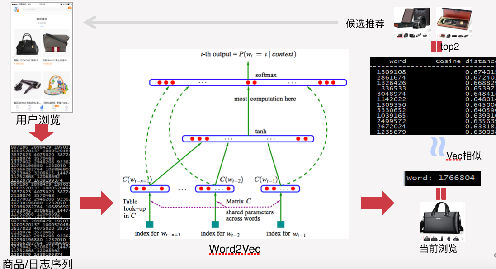

class: middle 

```{r setup, include=FALSE}
options(htmltools.dir.version = FALSE)
```

### 线下与线上的界限越发模糊
**信息化提升了经贸流通的效率**：  一个下单引发的系统运作  
   
???
电商、物流、移动  
数据流转  

消费拉动经济发展的三驾马车之一：商品从生产到消费完成，才算完成使命。  
图片来源：http://www.cheayou.com/solution/lingyufangan/dianzishangwu/2014/0219/44.html  

---
### <font color='blue'>数据</font>－问题－方法 
- **场景**  
#### Set(用户，商品，平台)
1. 用户：个人、企业、宠物、机器...  
1. 商品：消费品、工业品、金融产品、生活服务...   
1. 平台：C2C、B2C、C2B、B2B、O2O、CrowdFunding、CrossBorder...  

- **数据**：浏览、搜索、比价、下单、物流、评论、投诉...   
  

???
线上线下的融合越来越深入，这里的系统or平台，泛指零售和电商。接下来的部分问题，是线下零售和线上电商都要考虑的。  

wordcloud by：https://timdream.org/wordcloud

---
### 数据－<font color='blue'>问题－方法</font> 
- **推荐系统：无商不荐 无荐不推**  

  

???
这个可以稍微多啰嗦一下，社会和环境正在走向无处不在的推荐，我们在做的和将做的，很多都可以说是某种形态的推荐。  

---
### 数据－<font color='blue'>问题－方法</font> 
- **推荐系统：无商不荐 无荐不推**  

  

???
推荐已表现为一种生活常态（需求），以及产品形式（产品），不再只是后台的技术手段（算法）。
把推荐作为一种视角，来理解需求、产品和营销，它甚至已是商业模式设计的重要一环。

---
### 数据－<font color='blue'>问题－方法</font> 
- **推荐系统：算法更迭**  
关联分析、逻辑回归、协同过滤、矩阵分解、深度学习、深宽结合、强化学习、迁移学习、...   
  
[Wide & Deep Learning for Recommender Systems](https://arxiv.org/abs/1606.07792)  

---
### 数据－<font color='blue'>问题－方法</font> 
- **推荐系统：算法更迭**  

  

???
数据视角的应用认知，推荐是一个很好的视角和尝试，并且也是发展比较成熟的模式。  

---
### 数据－<font color='blue'>问题－方法</font> 
- **有钱的地方就有中介：DSP **   
  

---
### 数据－<font color='blue'>问题－方法</font> 
- **促销**  
玲琅满目的手段：立减、满减、捆绑、买赠、积分、返利、券码、试用、团购、抽奖、集赞；海报、电视、堆头、传单、首焦、搜索...  
就是不好好告诉你，到底卖多少钱。  
居家好男人必备技能，拿个小计算器算哪个合适。    
**问题：某区域用户的某商品做活动，选择哪种促销手段事半功倍？**    

- **方法**  
标注：过往促销活动前后的销量变化。   
数据：相同或同类商品的历史销售数据，以及促销活动的详细记录。  
模型：假设检验，方差分析，回归，聚类。  
应用：销量，销量，还是销量。 

???
在超市或者京东，把促销手段搜集和研究下，营销专家潜力无限。  
立足市场，有的时候，技术不是最主要的，文案才是。  
酒香巷子深，不走量的小众也是一种风格。  

---
### 数据－<font color='blue'>问题－方法</font> 
- **促销**  
玲琅满目的手段：立减、满减、捆绑、买赠、积分、返利、券码、试用、团购、抽奖、集赞；海报、电视、堆头、传单、首焦、搜索...  
就是不好好告诉你，到底卖多少钱。  
居家好男人必备技能，拿个小计算器算哪个合适。    
**问题：某区域用户的某商品做活动，选择哪种促销手段事半功倍？**    

- **方法**  
   

---
### 数据－<font color='blue'>问题－方法</font> 
- **销量预测**  
年初大计：做计划、提预算；年末大活：做总结。  
KPI领导下的组织运转，销量预测是实实在在的指导方针。  
**问题：某品牌某商品下一年的每个月的业绩指标是多少？是否要提前布置仓储物流的资源？**  

- **方法**    [⬅️](../datastory.html#12)   
标注：历史销量记录。   
数据：历史销量记录，以及节假日、促销、商品属性、人群特征等。  
模型：回归，[时间序列](./TimeSeries.key)。  
应用：KPI分解，提高仓储效率。 

---
class: center, middle

## [返回👈](../datastory.html#12)  

.smallfont[
.footnote[[*]powered by [xaringan](https://github.com/yihui/xaringan)@[Yihui Xie](https://yihui.name),[emojione](https://github.com/emojione/emojione)]    
]

