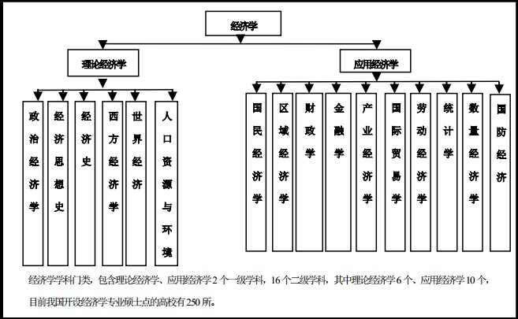
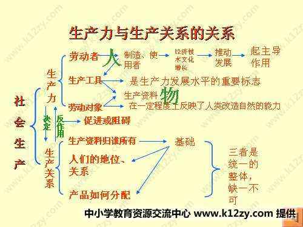

class: middle 

```{r setup, include=FALSE}
options(htmltools.dir.version = FALSE)
```

### 社会性与经济性
**群体与交换**  
经济在人类社会生活中已无孔不入，人的行为已深深刻上了经济的烙印。  
从个体到组织，从金融到整治，从微观到宏观...  
  

???
图片来源：https://zhidao.baidu.com/question/394092883748215325.html  

---
### <font color='blue'>数据</font>－问题－方法 
- **场景** 
#### Set(劳动者，生产工具，劳动对象)
  

- **数据**：一切社会活动都生产商品和数据   

???
提高社会生产效率，必然走向分工与交换。  

---
### 数据－<font color='blue'>问题－方法</font> 
- **证券市场** 
不只是股票，切个股票图

- **量化** 
指标
预测
hht

---
### 数据－<font color='blue'>问题－方法</font> 
- **统计局** 
统计指数，从局网站切个说明

- **抽样** 
意图分析、词包... 

### 数据－<font color='blue'>问题－方法</font> 
- **计量经济学** 
供需平衡
投资组合

- **从回归到结构方程** 
通话、短信、流量、缴费、漫游... 

### 数据－<font color='blue'>问题－方法</font> 
- **排名排序** 
国家、地区、学校、
要资源、影响力等等

- **层次分析法** 
经验与统计到结合 

???
做过城市到、图书馆到、商家商户的等等各种排名

---
class: center, middle

## 谢谢

.smallfont[
.footnote[[*]powered by [xaringan](https://github.com/yihui/xaringan)@[Yihui Xie](https://yihui.name),[emojione](https://github.com/emojione/emojione)]    
]

