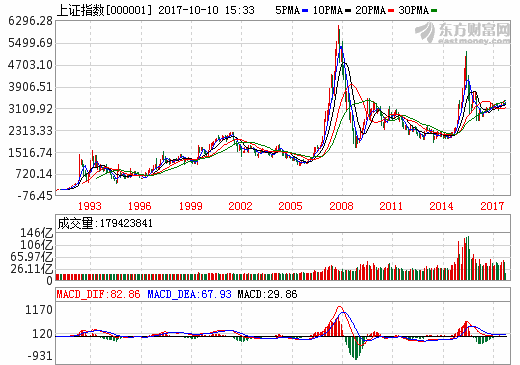
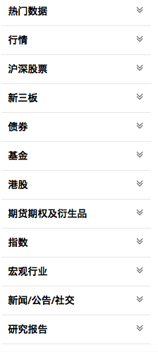
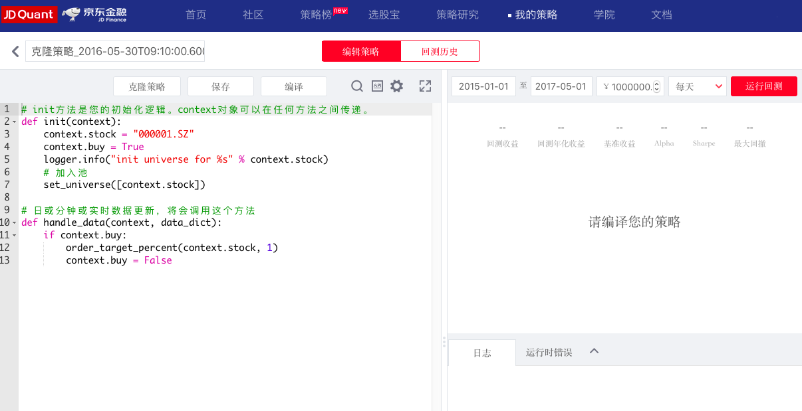
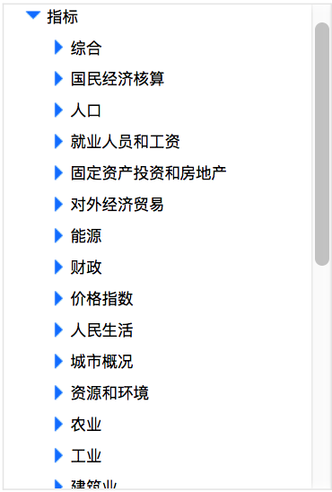
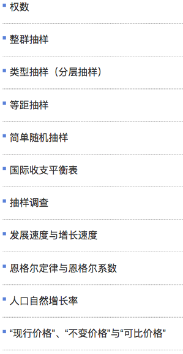

class: middle 

```{r setup, include=FALSE}
options(htmltools.dir.version = FALSE)
```

### 社会性与经济性
**人性：群体与交换**  
经济在人类社会生活中已无孔不入，人的行为已深深刻上了经济的烙印。  
从个体到组织，从金融到政治，从微观到宏观...  
  

???
图片来源：https://zhidao.baidu.com/question/394092883748215325.html  

---
### <font color='blue'>数据</font>－问题－方法 
- **场景：从思想到油盐，包罗万象** 
#### Set(劳动者，生产工具，劳动对象)  
  

- **数据**：一切社会活动都生产商品和数据   

???
提高社会生产效率，必然走向分工与交换。  

---
### 数据－<font color='blue'>问题－方法</font> 
- **场景：经济与思想**  

  [诺贝尔经济学奖揭晓,两观点相反者分享诺奖,2013](http://phtv.ifeng.com/program/cjxqs/detail_2013_11/04/30941298_0.shtml)  

  [个人决策之经济学和心理学的桥梁，2017年诺贝尔经济学奖](http://news.sina.com.cn/o/2017-10-10/doc-ifymrqmq2536567.shtml)  

  公式、代码、概率，都是为了一个决策。  

  代码确定？结果/解读是较为确定的。  
  分析不确定？天气／销量／风险…,又往往寻求先入为主的安慰。  
  最远的距离不是算法之于前手不能会，而是明知10%的中奖率仍纠结如何投入。  
  这个环境的本质也许就是概率描述的，怀疑与好奇，是推动其前进的动力。  

???
2013:法马教授证明了市场是有效的，席勒教授证明它的无效。  
诺贝尔委员会在申明中表示，几乎每个什么方法能够准确预测未来几天或几周的股市和债市，但是可以通过研究对较长时期内的价格进行预测。比如接下来三到五年的行情，这些研究结果正是汉森、法马和席勒三位经济学家所作的分析。  

经济范畴如此之大，实证和量化也是她的语言，不多阐述，仅举个例子就是。   

---
### 数据－<font color='blue'>问题－方法</font> 
- **证券市场**  
股票、期货、股指、期指、债券、外汇、组合、对冲等等。  

  

???
都是一坨一坨的数字游戏。  
看看MACD的两个波段，是否相似。  

---
### 数据－<font color='blue'>问题－方法</font> 
- **证券市场**：量化投资  
量化投资是指通过数量化方式及计算机程序化发出买卖指令，以获取稳定收益为目的的交易方式。——From百科  
[pinggu——量化专版](http://bbs.pinggu.org/forum-2166-1.html)  
[革命华尔街的kensho们](https://wallstreetcn.com/articles/309473)   

- **方法**
.pull-left[
标注：量价洞穿一切，历史判断未来。   
数据：各行各业，政经文娱。  
模型：指标、回归、时序、网络、集成，[钱海无涯 书途漫漫](https://search.jd.com/Search?keyword=量化投资&enc=utf-8&wq=量化投资&pvid=188b616a6ac74a1185746242c4a4970e)...  
应用：识好抓坏。  
]

.pull-right[
  
]

???
33岁的Kensho创始人Daniel Nadler预言：在未来十年内，由于Kensho和其他自动化软件，金融行业有三分之一到二分之一的雇员将失业。  
一个典型的工作场景是：早上八点，华尔街的金融分析师冲进办公室，等待即将在8点半公布的劳工统计局月度就业报告。他打开电脑，用Kensho软件搜集劳工部数据。Kensho提取的这些分析基于来自数十个数据库的成千上万条数据。  
两分钟之内，一份Kensho自动分析报告便出现在他的电脑屏幕上：一份简明的概览，随后是13份基于以往类似就业报告对投资情况的预测。  

数据图片来源：https://uqer.io/data/browse/0/?page=1  

---
### 数据－<font color='blue'>问题－方法</font> 
- **证券市场**：量化投资  
量化平台的一般形式。  

  

---
### 数据－<font color='blue'>问题－方法</font>  
- **统计局** [⬅️](../datastory.html#12)   

.pull-left[
那些数据  
  
]

.pull-right[
那些方法  
 
]

???
统计数据截图：http://data.stats.gov.cn/easyquery.htm?cn=C01  
统计指标截图：http://www.stats.gov.cn/tjzs/tjcd/  

---
class: center, middle

## [返回👈](../datastory.html#12)  

.smallfont[
.footnote[[*]powered by [xaringan](https://github.com/yihui/xaringan)@[Yihui Xie](https://yihui.name),[emojione](https://github.com/emojione/emojione)]    
]

