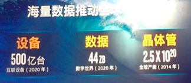
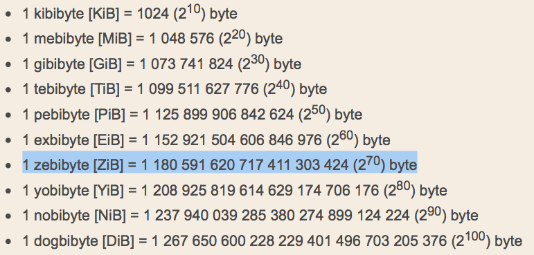
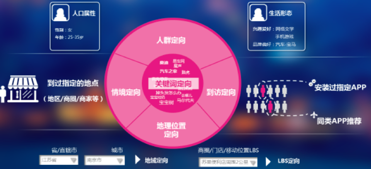
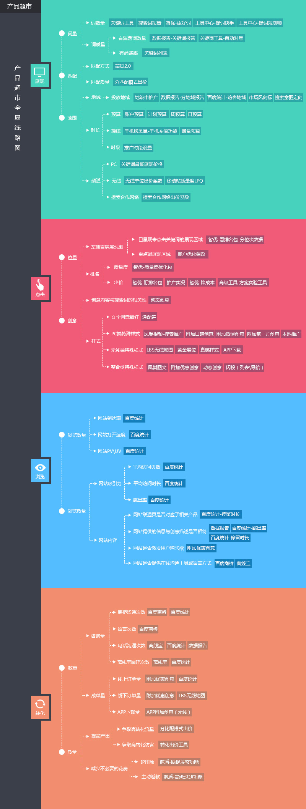
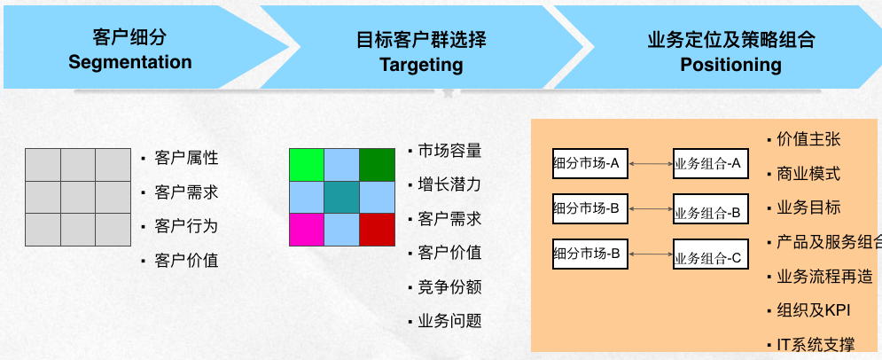
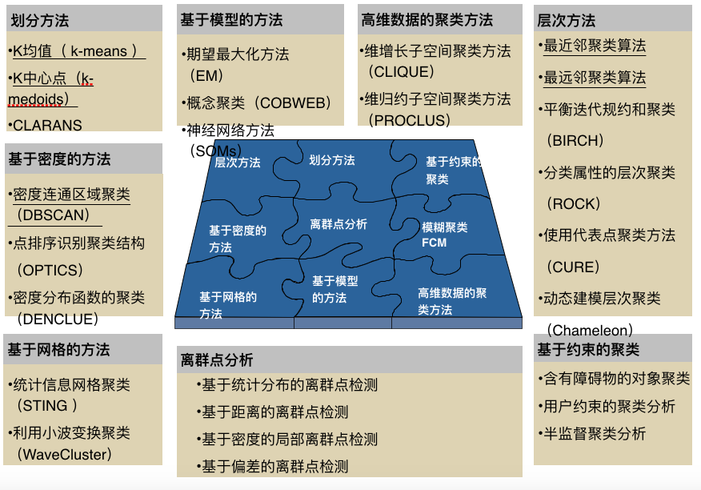
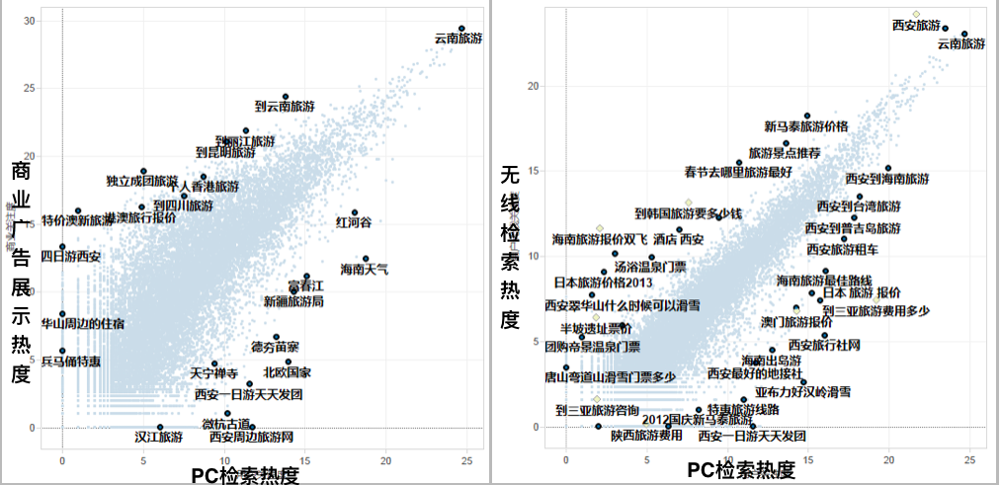
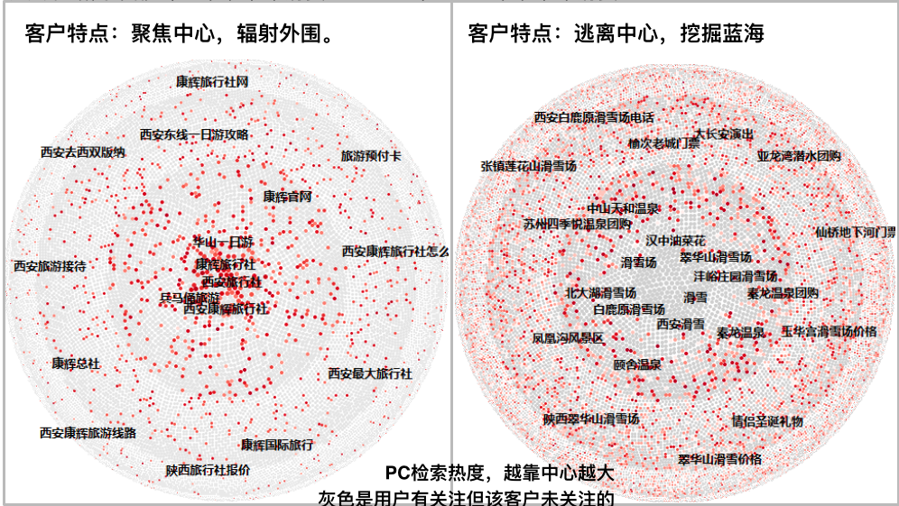

class: middle 

```{r setup, include=FALSE}
options(htmltools.dir.version = FALSE)
```

### 终日碌碌，所为无知

- **从 信息匮乏 到 信息泛滥**  

[英特尔预测2020年全球数据量达44ZB：中国占据五分之一](http://www.techweb.com.cn/data/2017-09-19/2586056.shtml)   


  

- 让人们最平等便捷地获取信息,找到所求  

???
搜索确实改变了获取信息的方式，从看报到问答，再到百度的宗旨“让人们最平等便捷地获取信息,找到所求”。  

那么我们看一下在你不用花钱的百度，何以为继...  
在这个模式下，就有相应的一些问题需要处理  

zbzb换算图参考：http://www.cnblogs.com/xjqlove1989/p/3879387.html 


---
### <font color='blue'>数据</font>－问题－方法 
- **场景** 
#### Set(用户，广告，平台)
1. 用户：主要对个人  
1. 广告：客户想要的，不一定是用户想要的   
1. 平台：合理地组织信息与广告并呈现  

- **数据**：网页、广告、搜索、点击...    
  

???
数据就是你在baidu站点搜索的一举一动  

图片来源：http://yingxiao.baidu.com/zhichi/knowledge/detail.action?channelId=1&classId=390&knowledgeId=13651  

---
### 数据－<font color='blue'>问题－方法</font> 
- **卖卖卖：把合适的广告以合适的方式呈现给合适的人**   
  

???
看的是商业端的视角，做的也就是广告主的策略。  
如何选词、如何出价、如何预算、如何创意。。。  

图片来源：http://yingxiao.baidu.com/topic/marketing/fc/index.html  

---
### 数据－<font color='blue'>问题－方法</font> 
- **客户分群**  
物以类聚 人以群分：聚类是探索群体特点的好方法。   
  

- **方法**  
标注：不监督 不标注。   
数据：客户的投放记录，浏览和点击用户的行为记录。  
模型：聚类分析。  
应用：制定客户服务策略的一个分类体系。 

---
### 数据－<font color='blue'>问题－方法</font> 
- **客户分群**：方法  
物以类聚 人以群分：聚类是探索群体特点的好方法。   
  

---
### 数据－<font color='blue'>问题－方法</font> 
- **客户与用户的行为分析**  
用户在平台不断的搜索、点击、浏览...  
客户在平台不断的选词、出价、写创意...  
**问题：客户的优化行为，是否击中了用户的潜在需求？怎么提升ROI？**    
- **方法** 
  

---
### 数据－<font color='blue'>问题－方法</font> 
- **客户与用户的行为分析**  
用户在平台不断的搜索、点击、浏览...  
客户在平台不断的选词、出价、写创意...  
**问题：客户的优化行为，是否击中了用户的潜在需求？怎么提升ROI？**    
- **方法** 
  

???
其他方法：模式挖掘，聚类分析。。。  

---
### 数据－<font color='blue'>问题－方法</font> 

- **信息检索**  
 - 数以亿计的页面，怎么组织，毫秒响应  
 - [pagerank](http://blog.csdn.net/monkey_d_meng/article/details/6554518)  
 
- **竞价排序**  [⬅️](../datastory.html#12)   
 $$排名 ＝ 出价 ＊ 质量度$$
 $$关键词点击价格 ＝ \frac{下一名出价 ＊ 下一名关键词质量度}{当前关键词质量度}$$
 - [出价、拍卖与博弈论](https://www.zhihu.com/question/57409967/answer/153279891)
 - [质量度，点击率预估](http://yingxiao.baidu.com/support/learning_unit_2277.html)

???
这个与运营商的例子不同，手机必须品，切换到其他服务商去，理由可以有很多。  
中文搜索，度厂的流量最大，效果好没理由不做，可以转换为效果提升的问题（点击转化）。  

问题、算法与挑战很多～  

---
class: center, middle

## [返回👈](../datastory.html#12)  

.smallfont[
.footnote[[*]powered by [xaringan](https://github.com/yihui/xaringan)@[Yihui Xie](https://yihui.name),[emojione](https://github.com/emojione/emojione)]    
]

