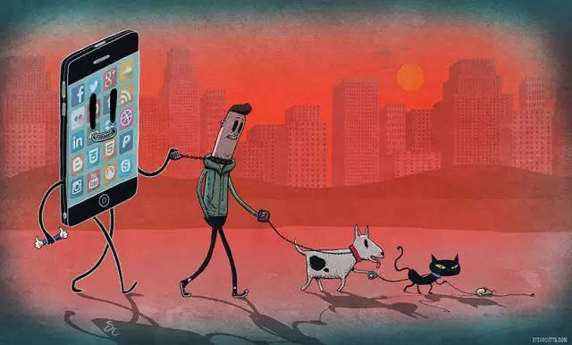
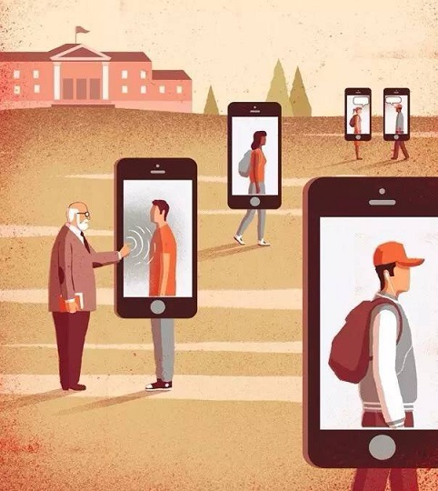
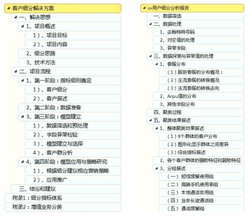
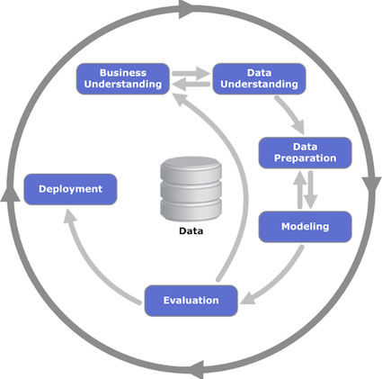
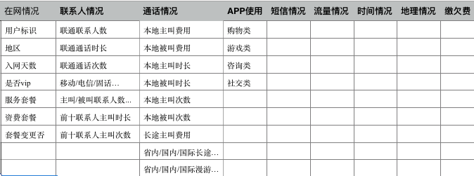
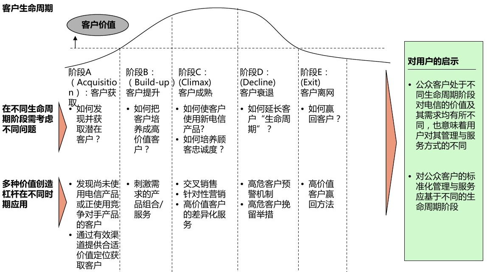
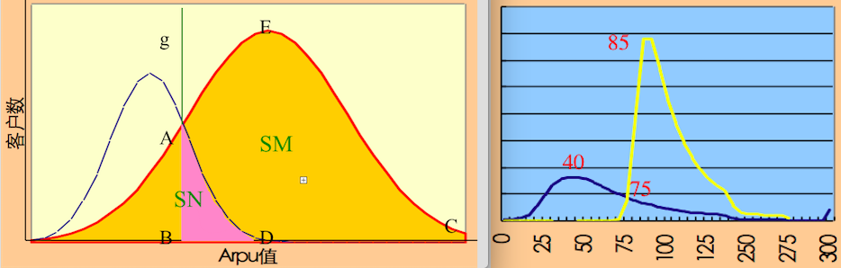
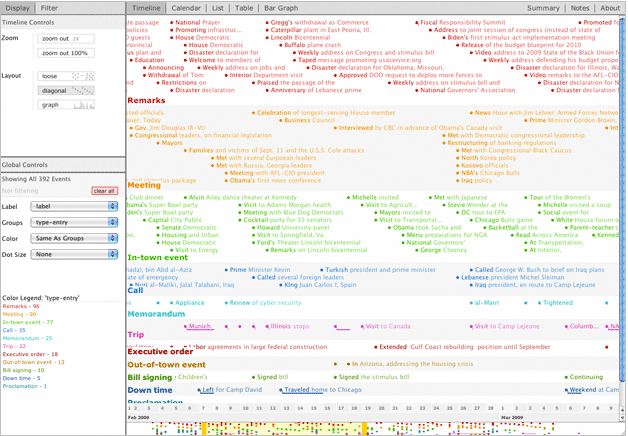

class: center, middle 

```{r setup, include=FALSE}
options(htmltools.dir.version = FALSE)
```

### 手机、人们和狗
**究竟是你在看着手机，还是手机在看着你**  
  

???
篱笆、女人和狗，开车玩手机有挂的、走路玩手机有挂的。。。手机重于生命哪
它已经是身体、生命的一部分，回顾下你一天、畅想一下你一生会有多少时间奉献给那些手机。
图片来源：http://news.ifeng.com/a/20170618/51273845_0.shtml 

---
class: center, middle

### 黑客帝国
**原来证明你是□你，现在证明\@你是你**
 

???
原来的数据是纸质档案，原来对数据的理解是人属性的扩展；到单位办事，你要到场，把你摆在中心，证明这个数据说的是你，所以有证明你妈是你妈；
现在的数据是电子数字，现在对数据对理解等同于人的存在；在网上办事，数据已经在场，把数据摆在中心，证明你是这个数据的生产者，所以有各种数字认证、签名；
区块链3.0中的表述：数据倒入程序，程序写入数据。
图片来源：http://news.ifeng.com/a/20170618/51273845_0.shtml 

---
# 三个关注点
## 数据－问题－方法  

    

???
讲数据和问题多一些，方法提一提，老师们会给你们机会好好研究的

---
### <font color='blue'>数据</font>－问题－方法 
- **场景**  
**Set(用户，手机，运营商)**
1. 用户：从匿名，到实名认证
1. 手机：从功能机，到智能机
1. 运营商：从基站，到营业厅

- **数据**  
通话、短信、流量、缴费、漫游... 
 


---
### 数据－<font color='blue'>问题－方法</font> 
- **生命周期**  
很常用的方法论，至今不衰，从到来到离去最大限度提升用户的贡献价值。  
问题简单分为3个方面：获客－养客－留客。    
Call Center、Service Provider、Database Marketing、EDM、SMS等等。  
 
???
通过CC、DM、SMS等途径，陌生短信和电话大力发展。现在实名认证了，  
图片参考：http://www.useit.com.cn/forum.php?mod=viewthread&tid=9279

---
### 数据－<font color='blue'>问题－方法</font> 
- **获客**  
客从何来，营业厅、学校、客服、互联网等等。  
**问题：预测对手客户的价值。**  

- **方法**  
标注：请主动迁移来的用户提供一部分历史账单。   
数据：网间通信的话单。  
模型：有监督的训练模型，线性回归。  
应用：主动营销。  

???
当前数据爆发的线上环境，营销不局限于自身渠道，合作伙伴的触达能力更为有效。这个过程没有个人信息的交互和透露，可以只是兴趣标签的匹配与推广。

---
### 数据－<font color='blue'>问题－方法</font> 
- **养客** 
挖掘用户需求，提升用户贡献。  
如果通话近乎免费，你会打更多打电话么？如果流量近乎免费，你会刷更多视频么？需求不用必须创造，只要让利和引导就会非常丰富。  
**问题：交叉销售，把合适的产品在合适的时间以合适的方式呈现给合适的用户。**琳琅满目的产品如手机邮箱、语音留言、电话会议、企业秘书、号码隐藏、短信包、流量包、彩铃炫铃、神奇宝典、互动视界...    

- **方法** 
标注：用户已有的不同产品的消费组合，无监督不标注。   
数据：过往对不同产品的使用记录。  
模型：无监督，关联算法；有监督，逻辑回归。  
应用：被动营销、主动营销。 

???
你们也许听过啤酒和尿布的故事，那有谁见过大超市把它们摆着很近么？我旁边的某家，尿不湿在2层，啤酒在－1层。 不妨碍关联算法是一个朴素有效的方法：已频繁出现的组合更容易搭配，其中置信度、支持度也都是概率的表述。  

---
### 数据－<font color='blue'>问题－方法</font> 
- **留客** 
留不住用户的人，那就在他对你的爱憎中成长。  
处于对信号覆盖、资费敏感、服务质量等考虑，用户都有可能离去，电话必不可少，此去必是对岸。  
**问题：预测哪些用户即将流失，以便启动维系挽留的关怀服务**  

- **方法** 
标注：连续3个月没有任何消费迹象的用户。   
数据：用户历史的消费行为。  
模型：有监督，逻辑回归。  
应用：被动关怀、主动关怀。  

???
预测到只是第一步，如何挽留有另一套系统与话术实施。通常也伴随着流失原因、挽留建议等配套方案的出具。

---
### 数据－<font color='blue'>问题－方法</font> 
- **欺诈** 
现在理解正常用户更换号码，还是挺麻烦的。  
但漫游高悬的时候，普通用户的号码更换也还是挺频繁的，学校一个、工作基本换了、换工作换城市换号码、合约机再换。  
没有实名，违约成本低，打到欠费换了就是。  
**问题：预测可能欠费违约的用户，降低其可透支话费。**  

- **数据** 
标注：已欠费并且没有活动迹象的用户。   
数据：用户历史的消费行为。  
模型：有监督，逻辑回归。  
应用：风险等级标注，透支时长调整。  

???
如果有一个那个年代最长听到的话评选：我选一个“您还可以通话1分钟”，IP电话卡。后付费这个事情是利弊双向的，让用户无感知地多消费了，他充值时候的扣抵等于增加收入，同时有信用就有违约。  

---
### 数据－<font color='blue'>问题－方法</font> 
- **套餐与定价**  
套餐、最低消费、xx包，霸王条款！搞价格歧视妥妥的。  
卖的就是频段的占用，不能简单按时长、流量、字节这样标准定价，按需售卖么？来个拥堵费也是可以接受的。现在，谁能说得出打2分50秒电话多少钱。  
**问题：争夺某群体用户市场，打降价牌，那么套餐定价多少比较合适？**  

- **数据**  
标注：用户已有的不同产品的消费组合，无监督不标注。   
数据：过往对不同产品的使用记录。  
模型：无监督，聚类算法、关联算法；有监督，逻辑回归。  
应用：被动营销、主动营销。  

???
没有复杂，何来溢价。  
如果你们谁做个应用，让大家话费套餐里的话费、流量以o2o的方式流转起来，你就是一个新的运营商了。  

---
### 数据－<font color='blue'>问题－方法</font> 
- **套餐与定价**  
套餐、最低消费、xx包，霸王条款！搞价格歧视妥妥的。  
卖的就是频段的占用，不能简单按时长、流量、字节这样标准定价，按需售卖么？来个拥堵费也是可以接受的。现在，谁能说得出打2分50秒电话多少钱。  
**问题：争夺某群体用户市场，打降价牌，那么套餐定价多少比较合适？**  

- **方法**  
 

---
### 数据－<font color='blue'>问题－方法</font> 
- **谁动了宅男的选择**  
分群也好、预测也罢，多是用群体的特征来预测个体的偏好。  
**问题：以个人的行为轨迹，预测个人的消费预期**  

- **方法**  
 

???
想法很简单，以每个人的时间序列数据，预测其消费、流失等行为，假设是外部环境带来的影响都反应在了这个人的历史行为之中。做法：写了一个循环，每个人建一个时间序列模型，几百万人，不出意外地没有算完。  
现在一些deep的模型，把id也作为特征，是一个比简单循环更美妙的方式，deep＋wide。 
图片参考：https://github.com/FlowingMedia/TimeFlow/wiki 

---
class: center, middle

## [返回](../datastory.html)

.smallfont[
.footnote[[*]powered by [xaringan](https://github.com/yihui/xaringan)@[Yihui Xie](https://yihui.name),   [emojione](https://github.com/emojione/emojione)]    
]

