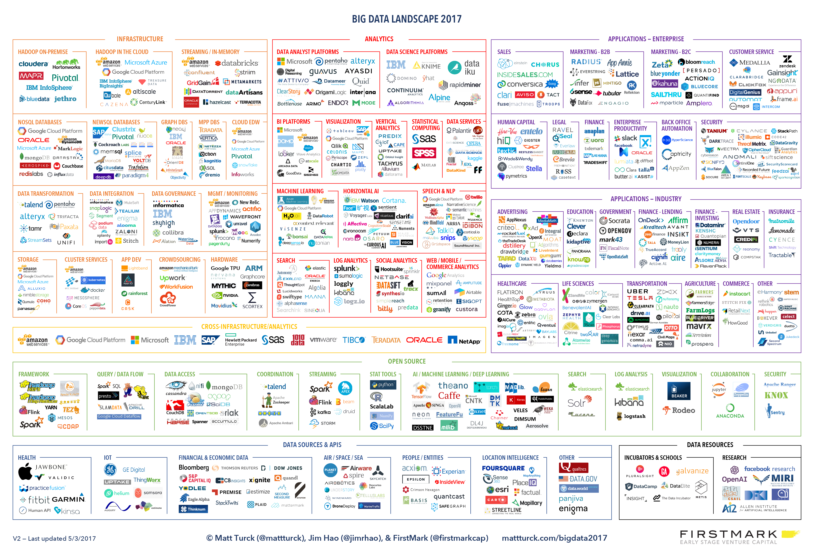

class: inverse, center, middle
background-image:url('img/warning2.png')

```{r setup, include=FALSE}
options(htmltools.dir.version = FALSE)
```

### 抛开剂量谈毒性...
### 抛开假设讲统计...
<br />
<br />
<br />
### 相关数字仅作示例...

.smallfont[
.footnote[[*]powered by [xaringan](https://github.com/yihui/xaringan)@[Yihui Xie](https://yihui.name),[emojione](https://github.com/emojione/emojione)]    
]

???
不评价剂量与毒性的关联，质疑的出发点是要讲程度与条件，做一些判断都是在一定的条件下给出的。  

倒不是说数字捏造，而是讲统计是有假设的，介绍的过程中不能把背景、样本等情况一一罗列，所以呢，如果提到一些数字均不代表官方意见，仅作示例用~  

背景图片来源：[tradesmartu](http://www.tradesmartu.com/blog/dire-warning-dow-theory)  

---
class: inverse

## 目录

- 框架、架构、方法论、分门别类...  .convert-emoji[:x:]  

- 前后划重点，中间讲故事  .convert-emoji[:white_check_mark:]   

- slides code: https://github.com/duerdu/datastory   

???
今天不做宏观大论，看书的目录、或者课程的设置就好。  

领的是命题作文，题目呢有些大，姑且切题理解下，这个呢也就算是我所理解的层次。  
中间的故事，也就是该理解的一点小小佐证。  
从细微处体会数据的涓涓细流渗透在每个人的身边。  

中间的方向，会有些跳跃，但我们今天就是讲这些五花八门的～   

---
class: inverse

## 概览  
 

---
class: inverse

## 切题  

数据和算法将是可预见的时期内，不可忽视的存在。

 

???
数据和算法将是可预见的时期内，不可忽视的存在。  

---
class: inverse

## 切题

- 数据科学.smallfont[家]的机遇与挑战  

  - **数据**：无处不在，无时不生  
  衣食住行吃喝玩乐，举目所及，生产和消费数据已是大多活动的附加意义。  
  
  - **机遇**：触手可及，是机遇，还是基础    
  当一个事务已潜移默化到没有知觉、普罗大众也开始饭后聊谈的时候，它就是项基本技能了，好比加减乘除，剩下的只有挑战。  
  
  - **挑战**：不再只是超越前人和经验，很多方面已经被AI搞定了  
  数据的特性：整体性和流动性，只盯着眼前数据很可能就是管中窥豹。  
  学习的机器：想想alphago、自动驾驶，如果创新赶不上算力的积累与提升，还能做什么，还能做什么是不可替代的？  
  
  - **科学.smallfont[家]**：探索未知与真理，构建知识与体系  
  在茫茫数据中驰骋之余，总结普适的认知与规律，若有所传承才敢妄谈。  

- 讲个故事  
示例一点点的数据、机遇、挑战，介绍场景和问题，算法什么的老师会给你们机会钻研的.convert-emoji[:grin:] 。  

???
站在这里，所写所说所现，目之所及无不数字化。这个世界终究是一坨数字，终究是属于你们的。数字己经无处不在，不管你看得见还是看不见，而统计与分析也己无处不在。  

数据是流通于组织的血液，以运营、经分、财务等尤其是报表的形式展现出来，这里面有两点很重要，整体性和流动性，只盯着眼前数据很可能就是管中窥豹、缘木求鱼。  
所见之数据底下是成套的体系和机制，没有这丝觉悟的分析就是扯淡。

大道至简，大数从小。

老师给的任务也是介绍下行业应用和浅薄经验，这些表象所见之余，是老师和学者们令人尊敬的研究，我们做的很多都是应用者但谈不上开创者。下面给大家介绍的都是一些用的形态，大家也不要忽视其真实的原理。

---
class: inverse

## 讲个故事

- 宅男的一天  

--
.bigface[ .convert-emoji[:alarm_clock:] .convert-emoji[:bed:] ]起床—
.bigface[ .convert-emoji[:iphone:] .convert-emoji[:computer:] ][手机](./ch-phone/phonestory.html#2)—
.bigface[ .convert-emoji[:shopping_cart:] .convert-emoji[:pancakes:] ][早点](./ch-ebusi/ebusistory.html#2)—  

--
.bigface[ .convert-emoji[:white_sun_rain_cloud:] .convert-emoji[:taxi:] ]出门—
.bigface[ .convert-emoji[:chart_with_upwards_trend:] .convert-emoji[:mag:] ][股票](./ch-economy/economystory.html#2)—
.bigface[ .convert-emoji[:woman_teacher:] .convert-emoji[:man_mechanic:] ][工作](./ch-esearch/searchstory.html#2)—  

--
.bigface[ .convert-emoji[:calling:] .convert-emoji[:bento:] ]午餐—
.bigface[ .convert-emoji[:woman_teacher:] .convert-emoji[:man_mechanic:] ]工作—
.bigface[ .convert-emoji[:convenience_store:] .convert-emoji[:coffee:] ][下午茶](./ch-techfin/techfin.html#2)—  

--
.bigface[ .convert-emoji[:performing_arts:] .convert-emoji[:cinema:] ]
.bigface[ .convert-emoji[:badminton:] .convert-emoji[:microphone:] ]
.bigface[ .convert-emoji[:couple_with_heart:] .convert-emoji[:person_in_bed_tone1:] ]夜生活  

--
- 其他
.bigface[ .convert-emoji[:airplane_departure:] .convert-emoji[:milky_way:] ]
.bigface[ .convert-emoji[:video_game:] .convert-emoji[:mahjong:] ]
＊[.bigface[ .convert-emoji[:ambulance:]]](./ch-bioinfo/biostory.html#2) ＊.convert-emoji[:police_car:]。。。  

- 数据的生产者&消费者

???
学习工作时：三百六十行，行行出状元，七百二十科，科科见统计。做论文，不来数据、模型、量化、实证，都不好意思跟人打招呼。  

起床看手机：引入通信篇  
早点：引入零售与电商，京东智能冰箱、智能音箱  
股票：引入经济篇  
工作：引入搜索篇  
下午茶：聊聊车、侃侃房，人可以放松 钱不行，引入科技金融篇  

---
class: inverse, middle

## 更多课题

- 回顾一下这匆匆一天，所涉广泛  
多少数据由你而生  
精密仪器、硬件、操作系统等等，支撑运转的基础设施，我们有几贡献。  
多少大公司的xx科学家，是从海外而来。。  

- [R 语言会议<sup>9th</sup>](https://cosx.org/2016/06/9th-china-r-beijing-summary)   
设 22 个分会场，126 场主题报告，...  
   
[公开Slides](http://pan.baidu.com/s/1c24sTmo)  

???
第九届中国 R 语言会议（北京），就在人大。  

---
class: inverse

## 更多课题  
   
[DTiii版2016中国大数据产业地图](http://www.dtiii.org)   

???
数据之河湍流不息，你是享受其中，还是抓住什么，还是随波逐流，尽在你心...  

---
class: inverse

## 但是  
大道至简，大数从小。  

   

所谓大数据，占据了太多的空间和焦点，容易忽视那些看起来渺小实际是症结的黑天鹅，更有甚者，把最初的决策之源都忽视了。  

???
所谓大数据，占据了太多的空间和焦点，容易忽视那些看起来渺小实际是症结的黑天鹅，更有甚者，把最初的决策之源都忽视了。  

---
class: inverse, middle

## 统计有风险，使用需严谨  

- [统计谎言——混淆视听的伎俩](http://open.163.com/movie/2014/12/Q/M/MAC0OTBRG_MAERJNVQM.html)  

- [相关与因果](https://wenku.baidu.com/view/f28ac41f650e52ea551898c9.html)  

- [ASA对P-value的声明](http://amstat.tandfonline.com/doi/abs/10.1080/00031305.2016.1154108)  

???
我们不只是数据的搬运工，更是数据的解读者，前路坑多，避免掉入所谓的统计陷阱，可以看看这3个资料。  

---
class: inverse, middle

## 数据有风险，从业需谨慎  

- [2017年6月1日，网安法解读](http://news.xinhuanet.com/yuqing/2017-06/02/c_129623651.htm)  

- [中华人民共和国网络安全法](http://www.miit.gov.cn/n1146295/n1146557/n1146614/c5345009/content.html)  

- [最高人民法院、最高人民检察院关于办理侵犯公民个人信息刑事案件适用法律若干问题的解释](http://www.court.gov.cn/fabu-xiangqing-43942.html)  

???
企业自产数据，服务内部应用，前面种种多为此类；  
用户授权数据，服务用户需求；  

---
class: inverse, middle

## 小结  

- .bigfont[运筹帷幄，决胜千里]  
  在这个数据横飞的时代，运筹帷幄，决胜千里，非你们莫属。  
  数据之河湍流不息，是享受其中，是抓住什么，还是随波逐流，尽在你心。  
  
  －－－   

- .bigfont[一沙一世界，公式探乾坤]  
  数学与统计的视角，不只是目之所及之花花世界的苟且应用，还有**美和真理** 。  
  
- .bigfont[不忘初心]  
  有一天，当你终将掌握某些数字的生杀大权时，希望你能**不忘初心**。

???
走马观花介绍了这么多所谓场景，于我自己已经是于你们想来大部分也都是看客，所以此刻忽略它们就好。  

最后，讲三句话送给大家：  
1.在这个数据横飞的时代，运筹帷幄、决胜千里，非你们莫属，前面所讲种种都是些小小案例。  

除了前面这个宅男无聊一天的故事，下面2句是更想讲与大家的。   

2.数学与统计不只是花花世界的苟且，还有美和真理。这沙这世界这公式这乾坤，下至微渺，上至宏宇，太多太多的未知了，你们不好奇么。大学也不只是社会的预科班，更应是承担人类探索的担当。  

3.不忘初心

---
class: inverse, center, middle

  .bigfont[beitta]   

.convert-emoji[:e-mail:]  .bigfont[ddqquu#qq.com]   

## 谢谢

.smallfont[
.footnote[[*]powered by [xaringan](https://github.com/yihui/xaringan)@[Yihui Xie](https://yihui.name),[emojione](https://github.com/emojione/emojione)]    
]

???
[emoji查询](https://emojipedia.org/)   
[为什么统计学家也应该学学 TensorFlow](https://cosx.org/2017/08/tensorflow-for-statisticians/)  

